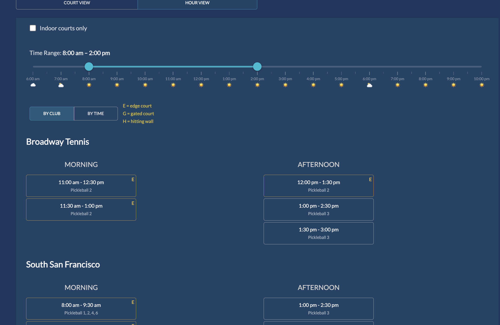
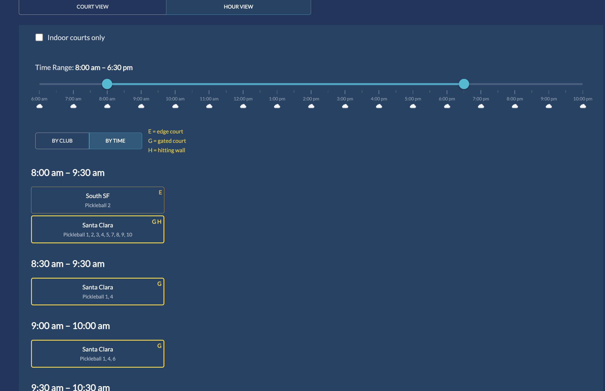
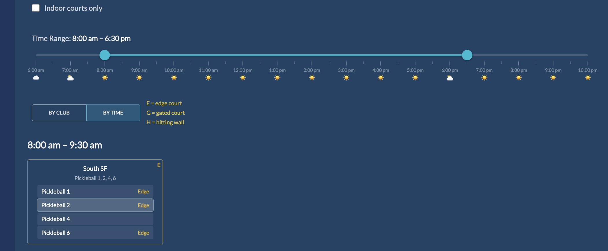
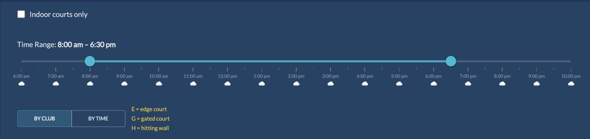
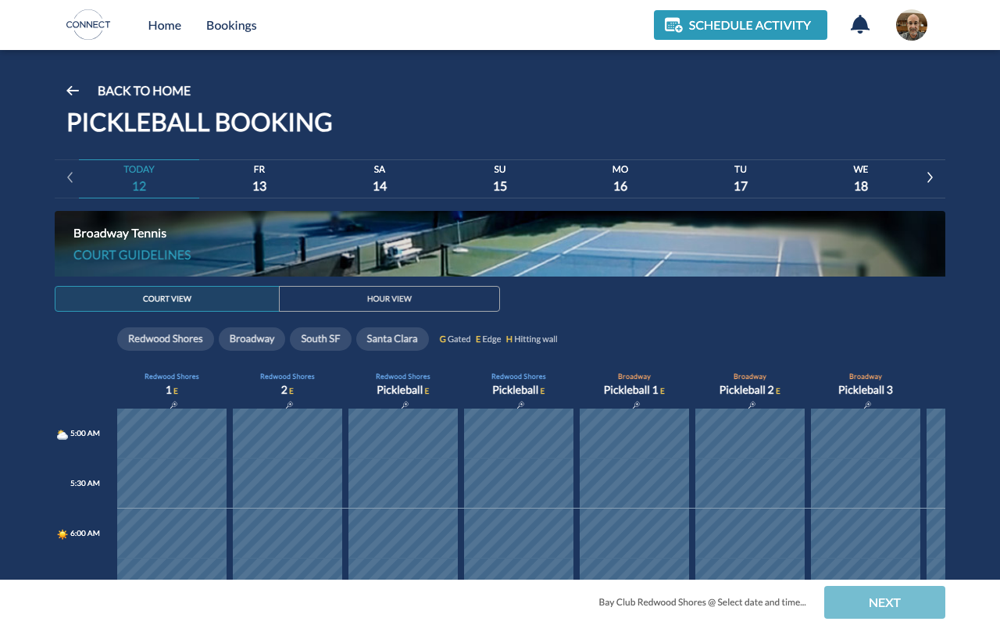
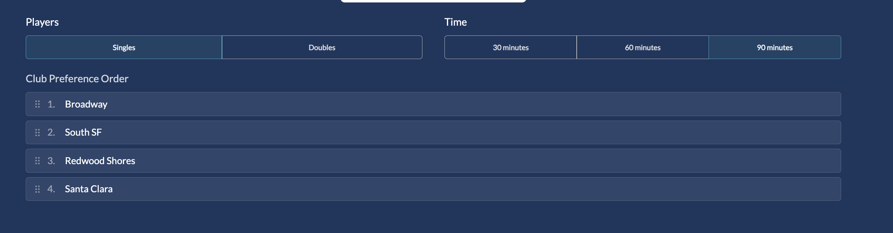
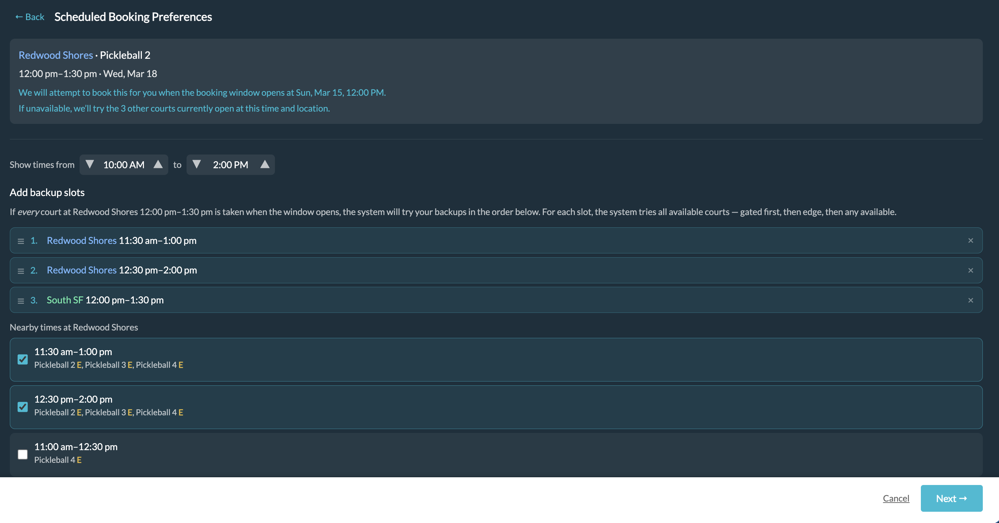
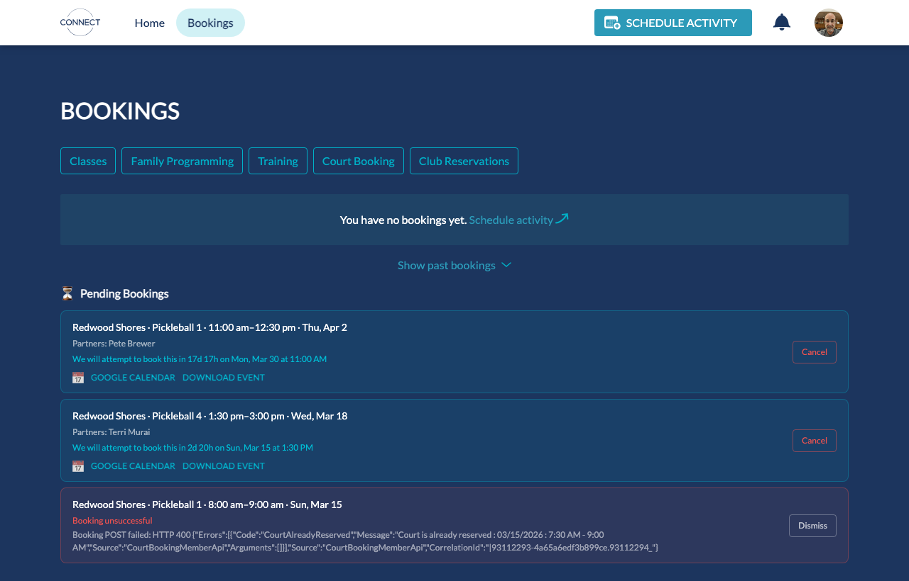
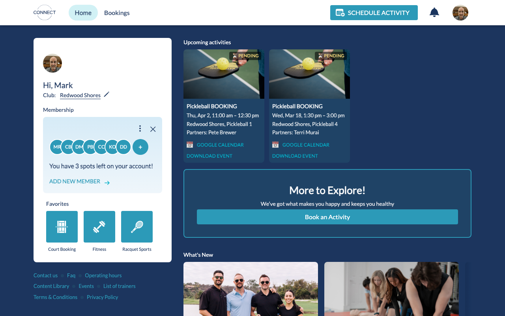

# Bay Club Connect Pickleball Helper

A Tampermonkey userscript that makes court booking at [bayclubconnect.com](https://bayclubconnect.com) much less painful for Bay Club members who play pickleball across the locations closest to the Peninsula: Redwood Shores, Broadway, South San Francisco, and Santa Clara.

The native app only shows court availability for whatever you have selected for your home club. That means seeing availabilty across clubs requires you to navigate one-by-one to the home club selector to update your club, and renavigate to the court availability list. This helper fetches all four clubs's court's availability regardless of your shome club and shows them all in one unified view. You can then book at whatever club you choose from that aggregated list.

---

## Installation

### Chrome

1. Install the [Tampermonkey Chrome extension](https://chromewebstore.google.com/detail/tampermonkey/dhdgffkkebhmkfjojejmpbldmpobfkfo)
Be aware that Tampermonkey allows you or someone to install scripts that inject into web pages and alter their behavior. Be careful.
3. Click "Add to Chrome" and confirm.
5. Navigate to the [script install URL](https://raw.githubusercontent.com/mbrubin56gh/bayclubconnect_helper/master/loading_script.user.js)
6. Tampermonkey will show an install dialog. Click "Install".
7. After you install it, click on the puzzle piece in your Chrome 
toolbar, find the Tampermonkey extension listed there, click on the vertical three dots, and click on "Manage Extension".


8. Make sure the Developer Mode toggle in the top right is switched on, make sure the On button is switched on, and scroll to the Allow User Scripts button and turn that on.

   

9. If you're still seeing a warning from Tampermonkey that developer mode is not turned on, quit Chrome and restart it.
10. Done! The script runs automatically on [bayclubconnect.com](bayclubconnect.com).
11. It might be convenient to have the Tampermonkey extension pinned.

Here's a video of manipulating the Tampermonkey extension:

https://github.com/user-attachments/assets/9d8c290a-9de8-43e9-9667-117bb6c05cdd

### Firefox

Tampermonkey is not supported on iOS or Chrome for Android, but it is supported by Firefox for Android.
The instructions are essentially the same as for Chrome:
1. Install the [Tampermonkey extension for Firefox](https://addons.mozilla.org/en-US/firefox/addon/tampermonkey/).
2. Navigate to the [script install URL](https://raw.githubusercontent.com/mbrubin56gh/bayclubconnect_helper/master/loading_script.user.js).
3. Follow whatever instructions you see to install the script.
4. That should be all you need. Navigate to the [Bay Club connect homepage](bayclubconnect.com) and log in.
5. It seems that the mobile Bay Club application is just a thin wrapper around their website. So instead of using the native app on Android, you can add a home screen shortcut to launching [bayclubconnect.com](bayclubconnect.com) via Firefox: in your Android Firefox, click on the three vertical dots in the top right, expand the "... More" section, and find the entry to "Add to Home screen". You can use that shortcut instead of the native app with no real loss of previous functionality, and you get the extension!

---

### Usage

- Install the extension.
- Log in to your account at [bayclubconnect.com](bayclubconnect.com).
- Navigate to the court booking page as normal, and you will see the Bay Club's web app UI augmented with extra helpers. They are discussed below, but it should feel pretty natural to use.

---

## Features

### Multi-club availability in one view

All four clubs — Redwood Shores, Broadway, South San Francisco, and Santa Clara — are fetched and shown together regardless of what you have selected as your main club. As without this extension, you can switch between **COURT VIEW** and **HOUR VIEW** layouts.

Edge courts are marked **E**, gated courts **G**, and courts next to a hitting wall **H**.

### Hour View

Within Hour View, you can now select to group availability primarily **BY CLUB** or **BY TIME**. 





If a club has multiple courts available for a time, you can click on the card and it will expand to allow you to chose your desired court.



### Time range filter, weather prediction, and indoor courts

A dual-handle slider allows you to filter showing court availability within your preferred playing hours. Hourly weather emoji appear along the slider. Broadway and South SF are indoor only. There is checkbox you can use to show only the indoor clubs.



Broadway and South San Francisco are indoor only. The indoor only checkbox allows you to toggle showing only courts at those clubs or at all the clubs (handy when the time range slider shows you rain is predicted).

### Court View

Court View now shows every court from all four clubs in a single horizontal calendar grid.



 Clicking a club's button at the top will jump to that club's court's columns, although you can also manually drag the horizontal scrollbar. Columns are tagged with the correct club so you always know which location you are scanning.

### Club preference ordering

When going through the booking flow, before you get to the availability listings, you can use the club reordering widget to change which order the clubs' courts will be shown in. Use the drag handles to reorder the clubs.



### Scheduled bookings

Bay Club opens the booking window 3 days in advance, to the half hour. For example, a 7:30 AM slot on Saturday opens on Wednesday at 7:30 AM. Slots beyond that window are locked by the native web page. With this extension, you can select a slot beyond the window and choose to schedule a booking to be attempted when the 3 day window first opens up. When the booking window opens, an attempt will be made to schedule your booking, and email you and your selected partner with the result. If the court you selected is not available, another court at the same time at the same club will be tried. And if you want to schedule further backup options for times around the time you're looking for, you can ask for them to be attempted as backups, too!



Bookings pending to be scheduled appear in your `/bookings` page and on your dashboard.

### Bookings page enhancements



The `/bookings` page gets a **Pending Bookings** section showing each scheduled booking with a live countdown, partner names, and **Google Calendar** / **Download Event** links. Failed attempts appear in red with a **Dismiss** button.

### Dashboard pending cards

Scheduled bookings appear as cards on the home dashboard alongside your confirmed bookings, so you can see everything at a glance.



---

## Developer Information

### How it works

**XHR interception** — The script patches `XMLHttpRequest.prototype.open` and `send` to intercept the native availability and court-booking requests before Angular reads them. When the native app fires a single availability request for the home club, the helper fires four parallel requests (one per club), merges the results, and delivers the combined payload back to Angular — which renders it as if the server sent it all at once.

**Angular state machine navigation** — Angular's booking flow is a state machine that requires real user clicks to advance. The helper secretly clicks a native Angular slot when you select one of the injected cards, advancing Angular's state. The outgoing booking POST is then rewritten with the correct club, court, time, and partners.

**Court View merging** — The same XHR interception pattern is applied to the two courtsheet endpoints Angular uses for Court View. All four clubs' court columns are merged into the response Angular renders, so every court appears natively as a real interactive column.

**Cloudflare Worker backend** — Scheduled bookings are persisted to a Cloudflare Worker (KV storage). A cron job fires every minute, picks up bookings whose window has opened, executes the two-step Bay Club booking API, and sends an email notification to you and your partners via Resend — regardless of whether your browser tab is open.


### Backend

The Cloudflare Worker handles:

- **Storing** scheduled bookings in KV storage
- **Firing** the Bay Club two-step booking API at the right moment (cron every minute)
- **Storing** refresh tokens per user so the Worker can authenticate without a browser session
- **Syncing** user preferences (club order, time range, view mode, etc.) across devices
- **Emailing** success/failure notifications via Resend


### Userscript tests

```bash
npm run test:script   # Vitest suite covering pure utility functions
```

### Worker tests

```bash
cd cloudflare-worker && npm test
```

### End-to-end canary tests

```bash
cd canary-tests && npm test                              # all browsers, headless
cd canary-tests && npm test -- --headed                  # all browsers, watch the browser
cd canary-tests && npm test -- --project=chromium        # desktop Chrome only
cd canary-tests && npm test -- --project=firefox         # desktop Firefox only
cd canary-tests && npm test -- --project=mobile-chromium # mobile Chrome (Pixel 5) only
```

Canary tests run against the live site with the userscript injected across three browser projects (desktop Chromium, desktop Firefox, and mobile Chromium on Pixel 5). They serve as both a regression guard and a canary for Bay Club DOM/API changes. Requires a `.env` file with `BC_EMAIL` and `BC_PASSWORD`.

### Deploy the Worker

```bash
cd cloudflare-worker && wrangler deploy
```
