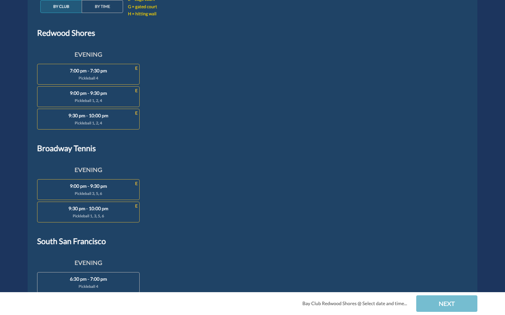

# Bay Club Connect Pickleball Helper

A Tampermonkey userscript that makes court booking at [bayclubconnect.com](https://bayclubconnect.com) much less painful for Bay Club members who play pickleball across all four Bay Area locations.

The native app only shows availability for your "home" club. This helper fetches all four clubs in parallel and shows everything in one unified view — so you can find the best open court without checking each club separately.

---

## Main availability view



Slots are grouped by club and time of day (Morning / Afternoon / Evening). Edge courts are marked **E**, gated courts **G**, and courts next to a hitting wall **H**. Multiple courts available at the same time collapse into a single expandable card.

---

## Features

### Multi-club availability in one view

All four clubs — Redwood Shores, Broadway, South San Francisco, and Santa Clara — are fetched in parallel and shown together. You can switch between **By Club** and **By Time** layouts.

### Time range filter and weather

A dual-handle slider filters slots to your preferred playing hours. Hourly weather emoji appear along the slider from Open-Meteo so you know what to expect on outdoor courts.

### Indoor courts toggle

Broadway and South SF are indoor only. The toggle hides outdoor-only clubs (Santa Clara and Redwood Shores outdoor courts) when you want to play indoors.

### Club preference ordering

Drag to reorder clubs in the priority you want them shown. Preference is saved and synced across devices.

### Court View — all clubs in one calendar grid


Switching to Court View shows every court from all four clubs in a single horizontal calendar grid. The club nav strip at the top lets you jump to any club's section. Columns are tagged with the correct club so you always know which location you are booking.

### Scheduled bookings

Bay Club opens the booking window exactly 3 days in advance at the minute of the slot. Locked slots (beyond the window) are clickable — tapping one opens an inline partner picker. Select your partners, tap **Schedule**, and the helper fires the booking automatically the moment the window opens, even if your browser tab is closed.

### Bookings page enhancements


The `/bookings` page gets a **Pending Bookings** section showing each scheduled booking with a live countdown, partner names, and **Google Calendar** / **Download Event** links. Failed attempts appear in red with a **Dismiss** button.

### Dashboard pending cards


Scheduled bookings appear as cards on the home dashboard alongside your confirmed bookings, so you can see everything at a glance.

---

## Installation

1. Install [Tampermonkey](https://www.tampermonkey.net/) for your browser.
2. Open the Tampermonkey dashboard and create a new script.
3. Paste the contents of [`loading_script.user.js`](loading_script.user.js) and save.
4. Navigate to [bayclubconnect.com](https://bayclubconnect.com) — the helper loads automatically on every page.

> The helper is gated by an allow-list checked on startup. If you are not already on the list, reach out to get added.

---

## How it works

**XHR interception** — The script patches `XMLHttpRequest.prototype.open` and `send` to intercept the native availability and court-booking requests before Angular reads them. When the native app fires a single availability request for the home club, the helper fires four parallel requests (one per club), merges the results, and delivers the combined payload back to Angular — which renders it as if the server sent it all at once.

**Angular state machine navigation** — Angular's booking flow is a state machine that requires real user clicks to advance. The helper secretly clicks a native Angular slot when you select one of the injected cards, advancing Angular's state. The outgoing booking POST is then rewritten with the correct club, court, time, and partners.

**Court View merging** — The same XHR interception pattern is applied to the two courtsheet endpoints Angular uses for Court View. All four clubs' court columns are merged into the response Angular renders, so every court appears natively as a real interactive column.

**Cloudflare Worker backend** — Scheduled bookings are persisted to a Cloudflare Worker (KV storage). A cron job fires every minute, picks up bookings whose window has opened, executes the two-step Bay Club booking API, and sends an email notification to you and your partners via Resend — regardless of whether your browser tab is open.

---

## Configuration

All preferences are persisted to `localStorage` and synced to the Worker so they carry over across devices and sessions.

| Control | What it does |
|---------|--------------|
| **Indoor courts only** toggle | Hides outdoor-only clubs from the availability list |
| **Time range slider** | Filters slots to your preferred playing hours |
| **By Club / By Time** toggle | Switches between grouping slots by club or by time |
| **Club order drag widget** | Sets the display order of clubs in the By Club view |
| **HOUR VIEW / COURT VIEW** tabs | Persists your preferred calendar layout across sessions |

---

## Scheduled bookings

Bay Club's booking window opens exactly **3 days in advance** at the minute the slot starts. For example, a 7:00 AM slot on Saturday opens on Wednesday at 7:00 AM.

To schedule a booking for a locked slot:

1. Navigate to the booking flow and select a date beyond 3 days out.
2. Tap any locked slot (shown with a lock or strikethrough style).
3. An inline partner picker appears — select your partners and tap **Schedule**.
4. The helper persists the record to the Worker. No need to keep the tab open.
5. At the exact moment the window opens, the Worker fires the POST and PUT to book the court and invite your partners.
6. You and your partners each receive an email confirmation (or failure notice).

Pending bookings appear on the `/bookings` page and on the home dashboard. You can cancel a pending booking at any time before it fires.

---

## Backend

The Cloudflare Worker at `bayclubconnect-bookings.mark-rubin.workers.dev` handles:

- **Storing** scheduled bookings in KV storage
- **Firing** the Bay Club two-step booking API at the right moment (cron every minute)
- **Storing** refresh tokens per user so the Worker can authenticate without a browser session
- **Syncing** user preferences (club order, time range, view mode, etc.) across devices
- **Emailing** success/failure notifications via Resend

---

## Development

### Userscript tests

```bash
npm run test:script   # Vitest suite covering pure utility functions
```

### Worker tests

```bash
cd cloudflare-worker && npm test
```

### End-to-end canary tests

```bash
cd canary-tests && npm test              # headless
cd canary-tests && npm test -- --headed  # watch the browser
```

Canary tests run against the live site with the userscript injected and serve as both a regression guard and a canary for Bay Club DOM/API changes. Requires a `.env` file with `BC_EMAIL` and `BC_PASSWORD`.

### Deploy the Worker

```bash
cd cloudflare-worker && wrangler deploy
```
